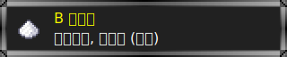
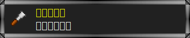
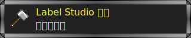
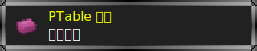

# Candy Pot 糖罐

~~这里是一罐糖, 用来喂猴~~

这里有一些脚本, 

## 油猴脚本

运行于 [Tampermonkey](https://www.tampermonkey.net/).

(点击图片以安装)

* [  ](https://github.com/FirokOtaku/CandyPot/raw/master/bilibili-optimizer.user.js)
  * 实在受不了 B 站这个垃圾 UI 了,  
    写了个简单的脚本 **按照我自己的口味** 处理页面内容
  * 去掉页面 Header 中的无用入口
  * 去掉首页轮播
  * 去掉直播推荐
  * 去掉少量广告
* [  ](https://github.com/FirokOtaku/CandyPot/raw/master/xiaoheihe-optimizer.user.js)
  * 不让复制粘贴内容是吧, 非得让下 APP 是吧?
* [  ](https://github.com/FirokOtaku/CandyPot/raw/master/label-studio-optimizer.user.js)
  * ~~Label Studio 自带的快捷键都什么臭鱼烂虾~~
  * 给 Label Studio 加一点 **真正有用** 的快捷键
  * (所有快捷键仅针对图片标注模式)
    * `Alt + [1-9]` 快速选择标注标签
    * `Alt + C` 隐藏和显示所有区域
    * `Alt + S` 保存
    * `Alt + Q` 上一张图片
    * `Alt + W` 下一张图片
    * `右键图片` 撤销
* [  ](https://github.com/FirokOtaku/CandyPot/raw/master/ptable-optimizer.user.js)
  * 广告再见

## 单行脚本

至少在桌面端 Chrome 浏览器下, 这些脚本可以直接保存为书签, 然后可以直接点击运行.

* 显示星号密码
  * 将页面上的 `<input type="password">` 修改为 `<input type"text">`
  * ```javascript
    javascript:"use strict";!function(){for(var t=document.getElementsByTagName("input"),e=0;e<t.length;e++)"password"===t[e].getAttribute("type")&&t[e].setAttribute("type","text")}();
    ```
* 解除网页限制
  * 可解除部分页面上不允许复制的限制
  * ```javascript
    javascript:"use strict";!function(){var t=function(t){t.stopPropagation(),t.stopImmediatePropagation&&t.stopImmediatePropagation()};["copy","cut","contextmenu","selectstart","mousedown","mouseup","keydown","keypress","keyup"].forEach(function(e){document.documentElement.addEventListener(e,t,{capture:!0})}),alert("解除限制成功啦！")}();
    ```
* 网页自由编辑
  * 让页面变得像 Word 一样可被自由编辑
  * ```javascript
    javascript:"use strict";!function(){"true"===document.body.getAttribute("contenteditable")?(document.body.setAttribute("contenteditable",!1),alert("网页不能编辑啦！")):(document.body.setAttribute("contenteditable",!0),alert("网页可以编辑啦！"))}();
    ```
* 复制 B 站纯净分享链接 ([源码](ols-bilibili-clean-share.js))
  * 尝试将当前 B 站页面不带任何追踪参数 (URL 的 query 参数) 的链接复制到剪切板
  * 使用 [JavaScript Compressor](https://www.giftofspeed.com/javascript-compressor/) 压缩
  * B 站部分页面的定位或传参基于 query 参数, 抹掉后会导致访问的页面与当前页面不同.
    (比如拜年祭页面, 比如搜索结果页面)
    出现此情况请手动复制处理 URL
  * ```javascript
    javascript:"use strict";!function(){let i=window.location.protocol+"//"+window.location.host+window.location.pathname;if(!i.includes("bilibili.com"))return;let t=document.title;t.endsWith("_哔哩哔哩_bilibili")&&(t=t.slice(0,-14)),navigator.clipboard.writeText(`${t} ${i}`).finally((()=>{}))}();
    ```

(前面 3 个脚本忘了从什么地方转载的了, 不是我自己写的)

## 改动记录

### Bibibili 优化

* 0.7.0
  * 提高搜索栏在未选中状态下的透明度
* 0.6.0
  * 现在会清理 **稍后再看** 页面的标题栏
* 0.5.1
  * 修复错误
* 0.5.0
  * 优化清理代码
  * 追加清理项
* 0.4.0
  * 清理方式变为仅隐藏 dom 节点, 而不再直接移除, 避免 B 站的 Vue 实例运行出现问题
  * 现在会移除 AdBlock 提示
  * 不再隐藏动态按钮

### 小黑盒优化

* 0.1.0
  * 允许复制文字和图片内容
  * 隐藏 APP 下载按钮

### B 站纯净分享链接

* 0.2.0
  * 现在复制出的链接会包含 URL 协议部分
* 0.1.0
  * 初步实现功能

### Label Studio 优化

* 0.2.0
  * 增加鼠标右键快捷键
  * 新增快捷键说明
* 0.1.0
  * 增加键鼠快捷键

### PTable 优化

* 去除页面顶部广告
